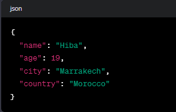

## Description
This Python program serves as an introductory example for beginners learning JSON file manipulation in Python. It demonstrates fundamental JSON handling, providing a simple yet illustrative example of reading, modifying, and writing JSON data.
## JSON File Preview

